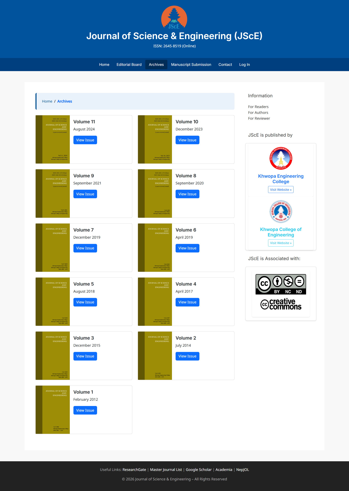
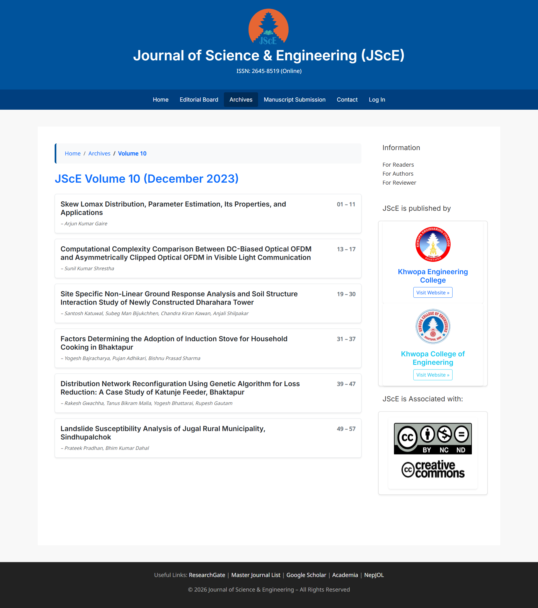
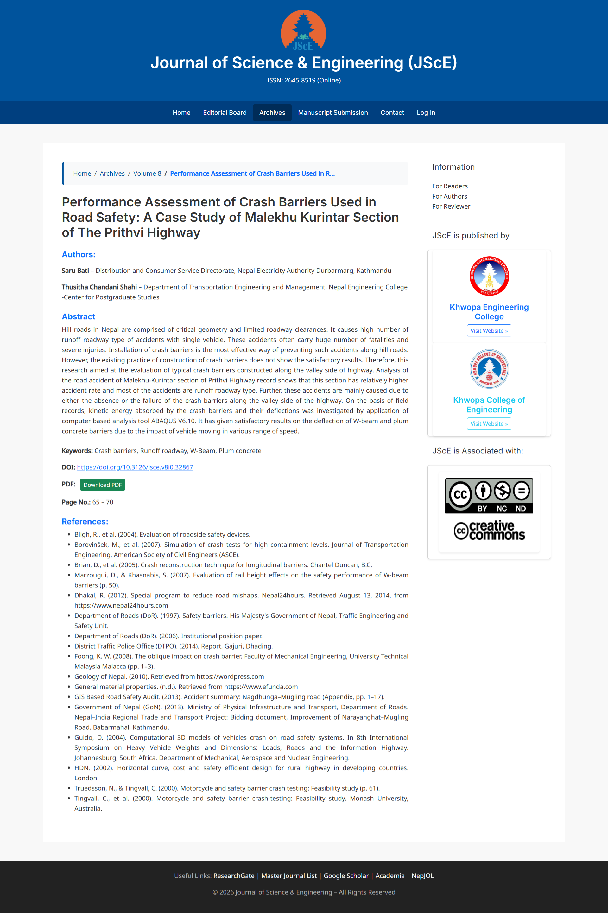

# Journal of Science and Engineering (JScE) – Journal Management System

This project is a **Django-based academic journal website** developed for managing and publishing issues of the *Journal of Science and Engineering (JScE)*.

The system is designed to present journal volumes, articles, abstracts, and downloadable PDFs in a clean, archive-oriented structure suitable for academic institutions and researchers.

🔗 **Live Website:** <a href="https://jsce.com.np/">https://jsce.com.np</a>

---

## Tech Stack

- **Backend:** Django
- **Database:** SQLite / PostgreSQL
- **Frontend:** HTML, Bootstrap, CSS
- **Media Handling:** Django Media Files
- **Architecture:** Function-based views (FBVs)

---

---

## Screenshots

### Archives

### Issue

### Article
 
